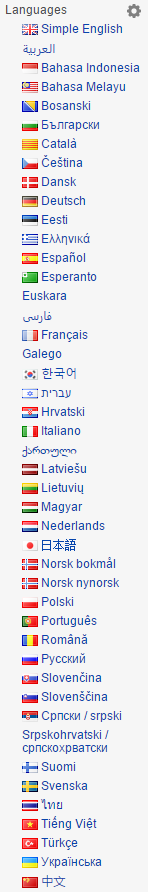

# Wikipedia Flag Icons   

### Info
Display flag icons to Wikipedia languages list on left sidebar.

New in v1.2: you can choose primary and secondary language to show near wikipedia page titles.

### Screenshot
Wikipedia Main Page (EN) using the script:

### List of wikis supported:
* wikipedia.org
* wikimedia.org
* wiktionary.org
* wikibooks.org
* wikidata.org
* wikinews.org
* wikiquote.org
* wikisource.org
* wikiversity.org
* wikivoyage.org

### Installation
##### Extension (Google Chrome)
1. Install the extension from the official [Google Chrome Webstore](https://chrome.google.com/webstore/detail/wikipedia-flag-icons/hcpffdppeejlgoaagghjfnecaofbghgp).

##### Userscript (Firefox & Opera)
1. Install [Greasemonkey](https://addons.mozilla.org/it/firefox/addon/greasemonkey/) (Firefox) or [Violent Monkey](https://addons.opera.com/en/extensions/details/violent-monkey/) (Opera);
2. Download my userscript from [here](https://github.com/DavideViolante/Wikipedia-Flag-Icons/raw/master/Userscript/wikipediaFlagIcons.user.js);
3. Drag and drop `wikipediaFlags.user.js` into your browser.
 
### Issues
Open an issue to tell me flags that are missing.

### License

